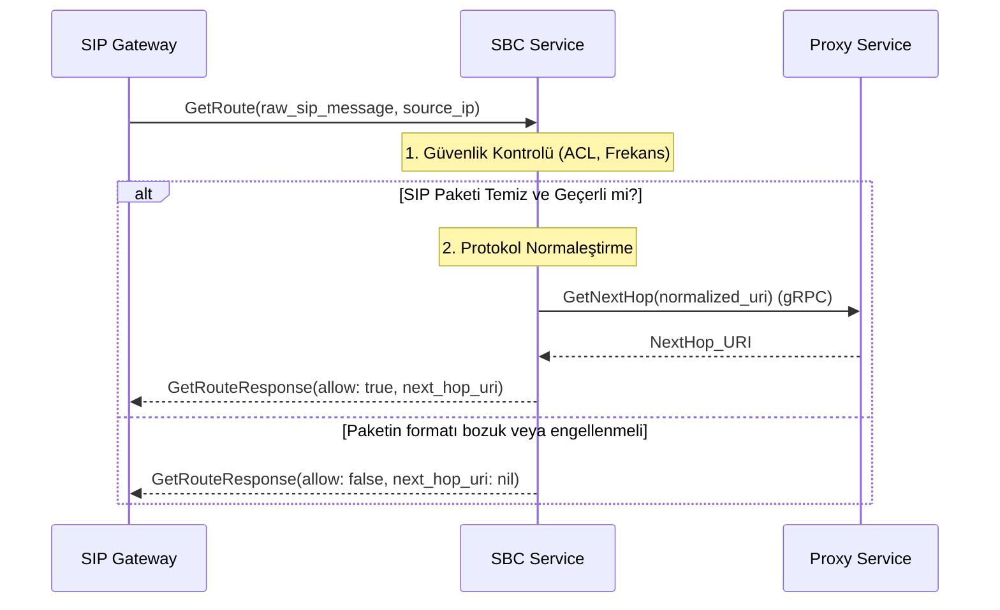

# 🔒 Sentiric SBC Service - Mantık ve Akış Mimarisi

**Stratejik Rol:** Harici SIP trafiğini analiz ederek, yönlendirme ve güvenlik kararı veren ilk savunma hattı.

---

## 1. SIP Yönlendirme ve Güvenlik Akışı (GetRoute)

