# 🔒 Sentiric SBC Service - Mantık ve Akış Mimarisi

**Stratejik Rol:** Harici SIP trafiğini analiz ederek, yönlendirme ve güvenlik kararı veren ilk savunma hattı.

---

## 1. SIP Yönlendirme ve Güvenlik Akışı (GetRoute)

```mermaid
sequenceDiagram
    participant SIPGateway as SIP Gateway
    participant SBC as SBC Service
    participant Proxy as Proxy Service
    
    SIPGateway->>SBC: GetRoute(raw_sip_message, source_ip)
    
    Note over SBC: 1. Güvenlik Kontrolü (ACL, Frekans)
    alt SIP Paketi Temiz ve Geçerli mi?
        Note over SBC: 2. Protokol Normaleştirme
        SBC->>Proxy: GetNextHop(normalized_uri) (gRPC)
        Proxy-->>SBC: NextHop_URI
        
        SBC-->>SIPGateway: GetRouteResponse(allow: true, next_hop_uri)
    else Paketin formatı bozuk veya engellenmeli
        SBC-->>SIPGateway: GetRouteResponse(allow: false, next_hop_uri: nil)
    end
```

